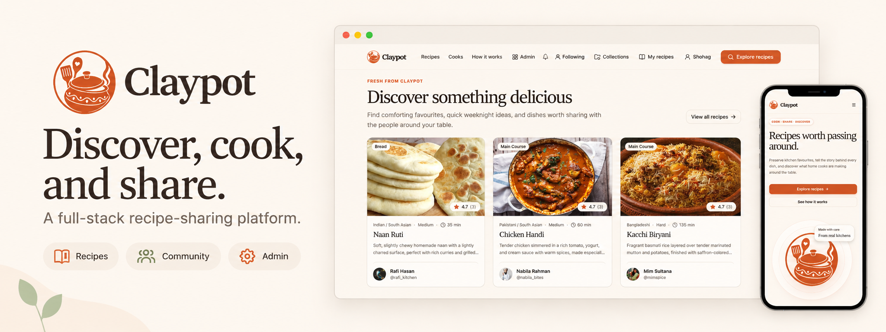
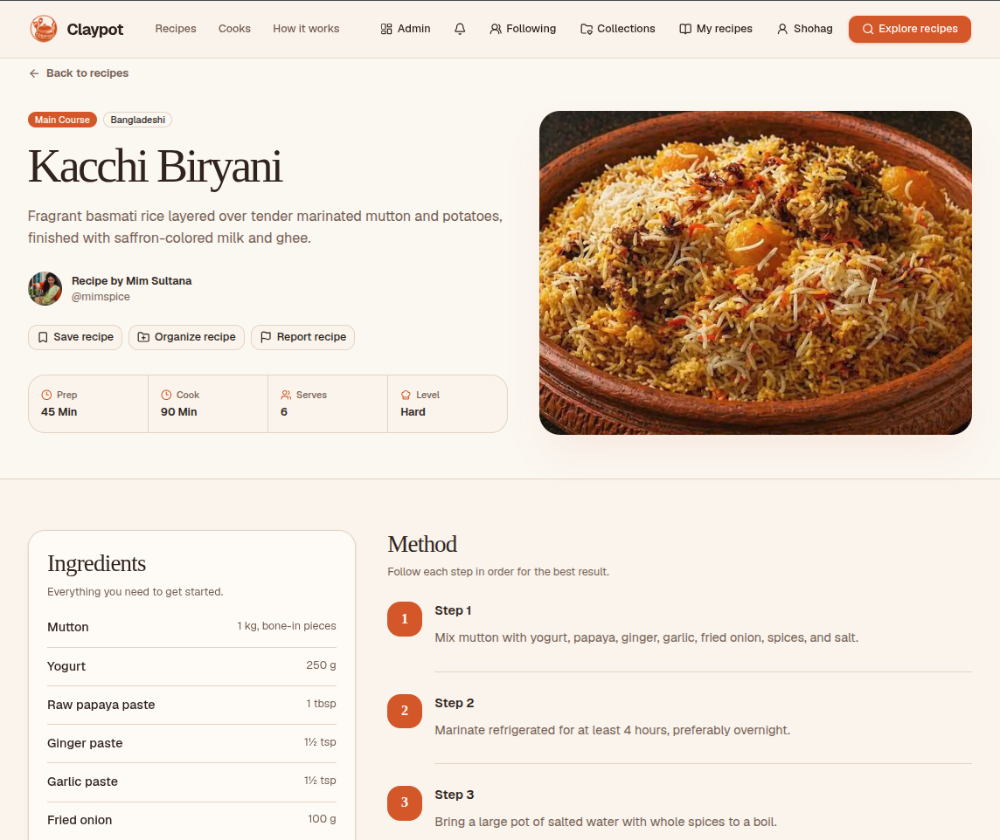
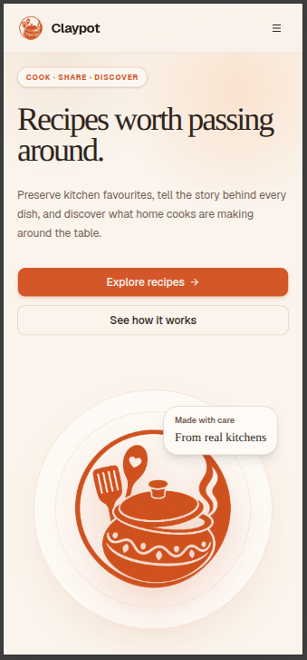
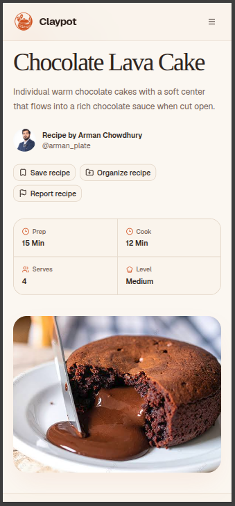
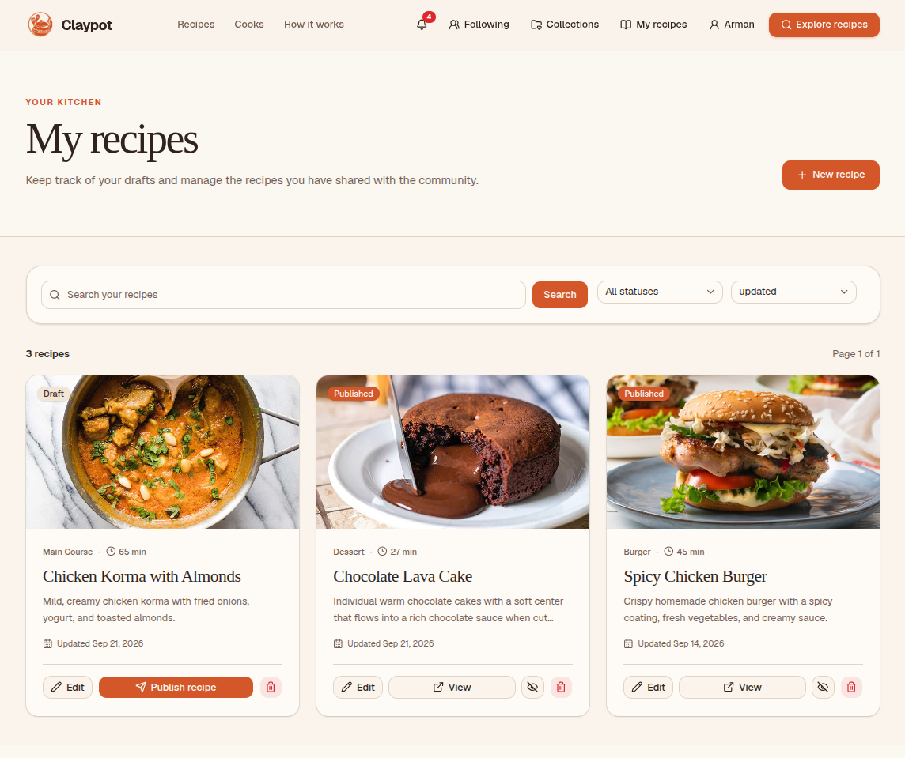
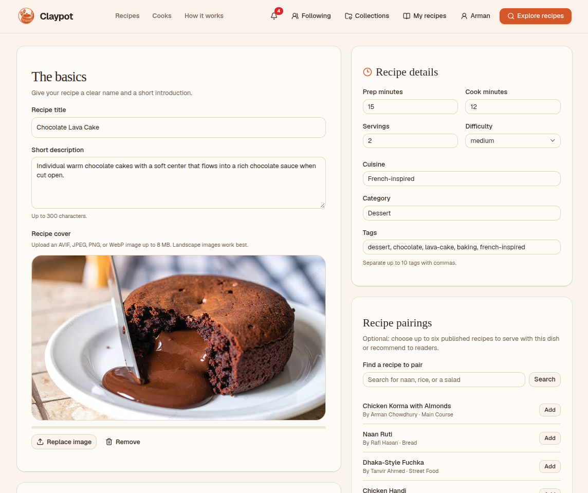
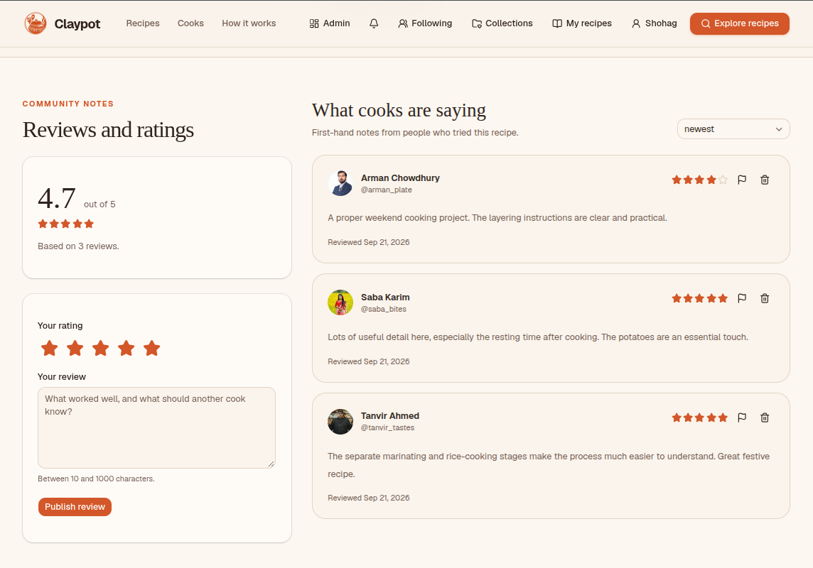
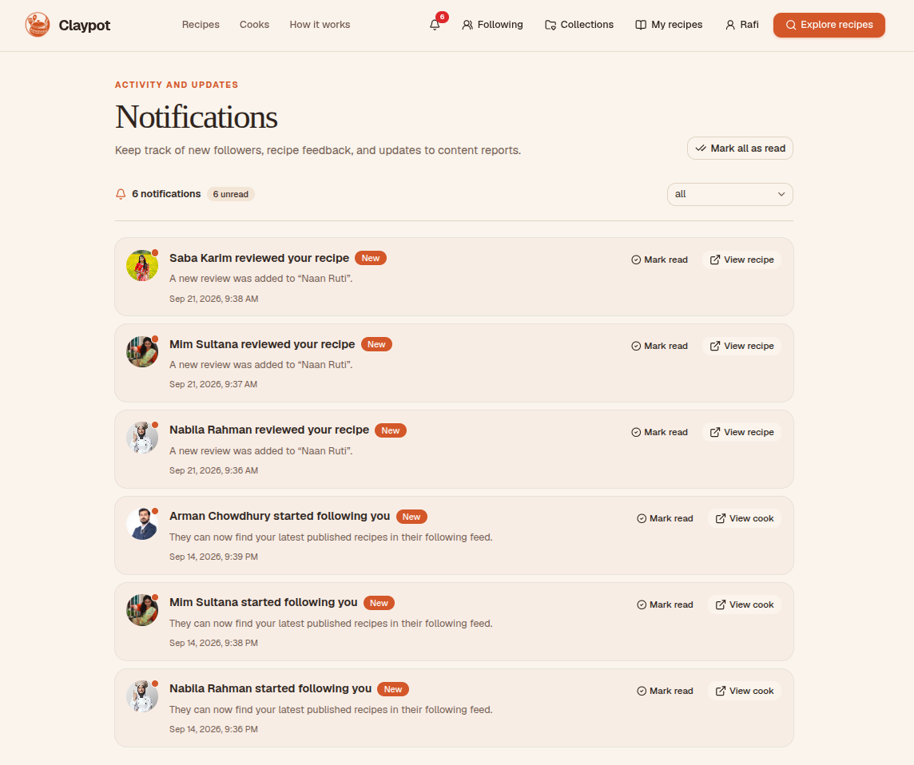
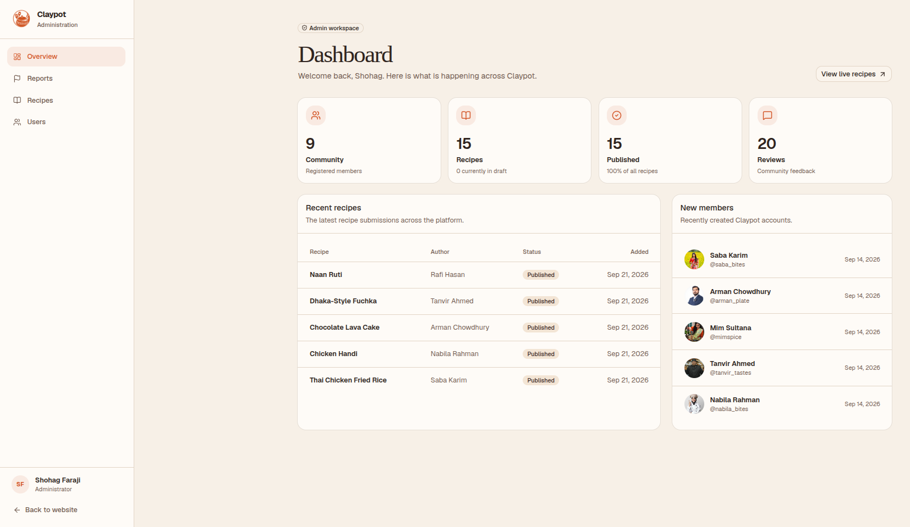

<a id="top" name="top"></a>

<h1 align="center">Claypot</h1>

<p align="center">
  A full-stack recipe-sharing platform built with the MERN stack and TypeScript.
</p>

<p align="center">
  <a href="https://claypot.netlify.app"><strong>Explore the live app</strong></a>
  &nbsp;·&nbsp;
  <a href="#product-tour">Product tour</a>
  &nbsp;·&nbsp;
  <a href="#engineering-decisions">Engineering</a>
  &nbsp;·&nbsp;
  <a href="#run-locally">Run locally</a>
  &nbsp;·&nbsp;
  <a href="#testing-and-ci">Tests</a>
</p>

<p align="center">
  
</p>

---

## Overview

Claypot is a full-stack recipe-sharing platform built with **MongoDB, Express, React, and
Node.js**, with **TypeScript across the client and API**. It brings recipe discovery,
publishing, personal collections, and a community of cooks into one application.

A recipe is more than a photo and a list of ingredients. Authors can suggest a side dish or
another recipe to try, readers can leave cooking notes and ratings, and followers can find
new dishes from cooks they enjoy. A separate administration workspace supports the community
with recipe moderation, user-role management, and content reports.

The project includes a responsive shadcn/ui interface, account-recovery and session-management
flows, signed image uploads, automated browser tests, and deployment configuration for
Netlify and Render.

### Try it

- **Without an account:** explore the [recipe library](https://claypot.netlify.app/recipes),
  open a recipe, read its reviews, and browse [cook profiles](https://claypot.netlify.app/cooks).
- **With an account:** create a draft, publish a recipe, save dishes into collections, leave a
  review, or follow another cook.
- **Admin workspace:** restricted to administrator accounts; the gallery below shows the
  dashboard without requiring elevated access to the demo.

The free API host may need time to wake after inactivity. Email-dependent features also have
a demo restriction; details are in [deployment and limitations](#deployment-and-limitations).

## Product tour

### From discovery to the kitchen

Search updates as you type, including partial words such as `chic` for chicken. Combine
cuisine, category, difficulty, and tag filters, then sort by cooking time, rating, popularity,
or publication date. Recipe pages bring the ingredients, method, serving information, and
author-selected pairings together.



### Built for smaller screens, too

Navigation, recipe actions, cooking information, and imagery adapt to a narrow viewport.

<table>
  <tr>
    <th align="center">Home</th>
    <th align="center">Recipe details</th>
  </tr>
  <tr>
    <td align="center"></td>
    <td align="center"></td>
  </tr>
</table>

<details>
<summary><strong>More screenshots: publishing, community, and administration</strong></summary>

### A cook's recipe workspace

Drafts stay private until published. Authors can edit, publish, unpublish, or delete their own
recipes from one place.



### Recipe editor

The editor combines the recipe cover, description, cooking details, and pairing selector.
Ingredient and instruction lists extend as entries are completed, and unused blank rows are
left out when saving.



### Reviews and ratings

Readers can share what worked for them, rate a dish, and report inappropriate content.



### Notifications

Review feedback and new followers appear in one inbox, with unread indicators, individual
and bulk read controls, and links to the relevant recipe or cook.



### Administration

The dashboard summarizes members, recipes, publications, and reviews. Dedicated screens
handle recipe moderation, user roles, and reported content.



</details>

## What you can do

| Area                  | Implemented capabilities                                                                                                                  |
| --------------------- | ----------------------------------------------------------------------------------------------------------------------------------------- |
| **Discover**          | Live partial-text search, combined filters, server-side pagination, cooking-time and community-rating sorts                               |
| **Publish**           | Drafts, editing, publish/unpublish controls, cover uploads, ingredient quantities, numbered steps, cooking times, and servings            |
| **Plan a meal**       | Author-selected pairings labelled as a side dish, sauce, drink, dessert, or related recipe                                                |
| **Organize**          | Saved recipes and private, named collections                                                                                              |
| **Connect**           | Cook profiles, following and followers, a following feed, reviews, ratings, and notifications for follows, reviews, and report outcomes   |
| **Manage an account** | Profile and avatar editing, email verification, email changes, password recovery, password changes, device sessions, and account deletion |
| **Moderate**          | Admin dashboard, recipe moderation, user-role management, and resolution or dismissal of recipe and review reports                        |

## Engineering decisions

### Same-origin authentication across two hosts

The React client is served by Netlify and the Express API runs on Render. A
[Netlify edge proxy](netlify/edge-functions/api.ts) forwards `/api/*` requests so refresh
cookies remain first-party. The API validates a shared proxy secret, while the proxy supplies
the visitor address used for rate limits and session history. Health checks remain available
without the proxy.

Access tokens stay in client memory. Refresh tokens rotate, are stored as hashes in MongoDB,
and are sent in HTTP-only cookies with the secure flag enabled in production. Users can
inspect and revoke their sessions. See the [session service](server/src/services/session.service.ts).

### Account recovery with one-time credentials

[Password recovery](server/src/services/password-recovery.service.ts) uses hashed, expiring,
single-use tokens, generic request responses, resend cooldowns, and rate limits. A successful
reset changes the password and revokes refresh sessions in a transaction. A signed-in
password change instead rotates the current session and revokes the others.

### Permissions and data consistency belong on the server

Zod validates API input before it reaches service logic. Recipe ownership and admin roles
are checked server-side; hiding a button is not the permission boundary. Public queries
exclude drafts, and collection operations are scoped to their owner.

Related database writes use transactions, including account deletion, password recovery,
and review creation. Startup [checks transaction support and prepares indexes](server/src/config/database-indexes.ts)
without dropping existing indexes. This is why local MongoDB must support replica sets.

### Signed uploads without exposing the media secret

The API [signs upload parameters](server/src/services/media.service.ts) for a user-specific
image namespace. The browser then uploads directly to Cloudinary, with progress feedback
and cancellation. File-format restrictions, managed asset identifiers, and checks against
deleting images still in use support the upload lifecycle.

### Search that remains usable while typing

The recipe library debounces input, keeps filters in the URL, resets pagination when filters
change, and ignores stale responses. The API matches escaped partial text across titles,
descriptions, tags, and ingredients. Multiple search terms can match across those fields.
See the [recipe listing service](server/src/services/recipe.service.ts) and
[discovery browser tests](e2e/specs/discovery.spec.ts).

## Architecture and stack

```text
React client · Netlify
    │
    ├── /api/v1 → Netlify edge proxy → Express API · Render
    │                                     ├── MongoDB Atlas · data and sessions
    │                                     ├── Resend · account emails
    │                                     └── Cloudinary · upload signing and cleanup
    │
    └── Signed file upload ───────────────────→ Cloudinary
```

| Layer                    | Technologies                                                                     |
| ------------------------ | -------------------------------------------------------------------------------- |
| **Interface**            | React 19, React Router, TypeScript, Vite, Tailwind CSS, shadcn/ui, Lucide icons  |
| **API**                  | Node.js, Express 5, TypeScript, Zod, Pino logging                                |
| **Persistence**          | MongoDB, Mongoose, transactions, schema-defined indexes                          |
| **Authentication**       | JWT access tokens with jose, rotating refresh sessions, bcrypt password hashing  |
| **Integrations**         | Cloudinary for media; Resend for account emails                                  |
| **Quality and delivery** | Vitest, Supertest, Playwright, ESLint, Prettier, GitHub Actions, Netlify, Render |

The application uses npm workspaces. Frontend features group their API requests, hooks,
components, and types. On the server, routes and controllers handle HTTP concerns, schemas
validate input, and services contain application logic.

<details>
<summary><strong>Repository structure</strong></summary>

```text
claypot-mern/
├── client/
│   ├── public/             Static assets and hosting redirects
│   └── src/
│       ├── components/     Shared UI and layouts
│       ├── features/       Feature-specific requests, hooks, and components
│       └── pages/          Application pages
├── server/
│   ├── src/
│   │   ├── config/         Environment, database, indexes, and logging
│   │   ├── routes/         REST endpoints
│   │   ├── controllers/    HTTP request and response handling
│   │   ├── schemas/        Zod request validation
│   │   ├── services/       Application logic
│   │   ├── models/         Mongoose models
│   │   └── middleware/     Authentication, authorization, and request guards
│   └── tests/              Server tests
├── e2e/                    Playwright scenarios and isolated fixtures
├── netlify/                Edge proxy and its tests
├── docs/                   Deployment guide and product screenshots
└── .github/workflows/      Continuous integration
```

</details>

## Testing and CI

Tests cover the application at three levels:

| Level                  | Scope                                                                                                                                                                |
| ---------------------- | -------------------------------------------------------------------------------------------------------------------------------------------------------------------- |
| **Unit and API tests** | Client logic, validation, permissions, service behaviour, authentication, and HTTP responses using Vitest and Supertest                                              |
| **Proxy tests**        | Forwarding rules, configuration validation, cookie handling, and upstream failures                                                                                   |
| **Browser tests**      | Account flows, password recovery, session management, recipe publishing and pairings, collections, community interactions, moderation, and selected mobile scenarios |

The [Playwright harness](e2e/support/server.ts) starts a temporary MongoDB replica set, a local
email transport, the API, and the client. Fixtures reset between tests. It does not use the
database in `server/.env`, send real emails, or require production provider credentials.

[GitHub Actions](.github/workflows/tests.yml) runs type checks, linting, formatting, unit/API
tests, a production build, and browser tests on pull requests and pushes to `main`. Browser
reports and failure artifacts are retained for inspection.

```bash
npm run typecheck
npm run lint
npm run format:check
npm test
npm run build
```

Run the browser suite separately:

```bash
npm run test:e2e:install
npm run test:e2e
npm run test:e2e:report
```

The first browser-test run downloads a MongoDB binary. Chromium also needs its system
dependencies; on a Linux runner, use `npx playwright install --with-deps chromium`.
Automated tests do not verify live Cloudinary credentials or real email deliverability.

## Run locally

### 1. Prerequisites

- **Node.js 22.12+ and npm 9+.** CI and deployment use Node.js 22.
- **MongoDB Atlas or a local replica set.** A standalone MongoDB process cannot run the
  transactions this application requires.
- **Optional integrations:** Cloudinary credentials for uploads and Resend credentials for
  account emails. Other features can run without them.

### 2. Install and configure

From a local copy of this repository:

```bash
npm ci
cp server/.env.example server/.env
cp client/.env.example client/.env
```

Skip the relevant copy command if an environment file already exists. In `server/.env`, set
`MONGODB_URI` to a **separate development database** and replace `ACCESS_TOKEN_SECRET` with a
random value of at least 32 characters:

```bash
node -e "console.log(require('node:crypto').randomBytes(32).toString('hex'))"
```

The local defaults are `CLIENT_ORIGIN=http://localhost:5173`, `PORT=5000`, and an empty
`API_PROXY_SECRET`. The client example points `VITE_API_URL` to `http://localhost:5000/api/v1`.

<details>
<summary><strong>Configure optional image and email services</strong></summary>

| Integration | Server variables                                                       | Without the integration                                       |
| ----------- | ---------------------------------------------------------------------- | ------------------------------------------------------------- |
| Cloudinary  | `CLOUDINARY_CLOUD_NAME`, `CLOUDINARY_API_KEY`, `CLOUDINARY_API_SECRET` | Remove all three lines; image uploads will be unavailable     |
| Resend      | `RESEND_API_KEY`, `EMAIL_FROM`                                         | Remove both lines; account-email delivery will be unavailable |

The example environment contains placeholder values. Replace the complete set for each
provider or remove it; do not leave placeholder credentials configured. A Resend testing
sender cannot deliver to arbitrary recipients.

</details>

Keep credentials in the server environment, never in Git or `VITE_` variables. Do not use the
live application's database for local development.

### 3. Start the application

```bash
npm run dev
```

Open `http://localhost:5173`. The API runs at `http://localhost:5000`, with a readiness check
at `/api/v1/health/ready`. You can also run the workspaces separately with `npm run dev:client`
and `npm run dev:server`.

A new database starts empty. Register an account and create recipes through the application.
The browser-test fixtures are not a development or production seed command.

## Deployment and limitations

The live deployment uses **Netlify** for the frontend and same-origin proxy, **Render** for
the API, **MongoDB Atlas** for persistence, **Cloudinary** for media, and **Resend** for account
email integration. Hosting configuration lives in [netlify.toml](netlify.toml) and
[render.yaml](render.yaml). The [deployment guide](docs/deployment.md) covers environment
variables, database preparation, provider setup, health checks, and release verification.

The current deployment has the following boundaries:

- **Free-host cold starts.** The API can sleep after inactivity, delaying the next request.
  See [Render's free-service behaviour](https://render.com/docs/free).
- **Restricted demo email.** The current testing sender is not configured for public
  delivery. Verification, password-reset, and email-change messages need a verified sender
  domain to reach arbitrary visitors. See [Resend's testing-domain restrictions](https://resend.com/docs/knowledge-base/403-error-resend-dev-domain).
- **Short-lived access tokens.** Revoking a session stops refresh-token renewal;
  already-issued access tokens remain valid until expiry, which defaults to 15 minutes.
- **Single-instance rate limits.** Counters are held in memory. Multiple API instances would
  need shared storage for consistent limits.
- **Search at larger scale.** Partial matching currently uses escaped regular expressions.
  A larger catalogue would need a dedicated search index to retain predictable performance.

---

<p align="center">
  <a href="https://claypot.netlify.app">Explore Claypot</a>
  &nbsp;·&nbsp;
  <a href="docs/deployment.md">Deployment guide</a>
  &nbsp;·&nbsp;
  <a href="#top">Back to top</a>
</p>
